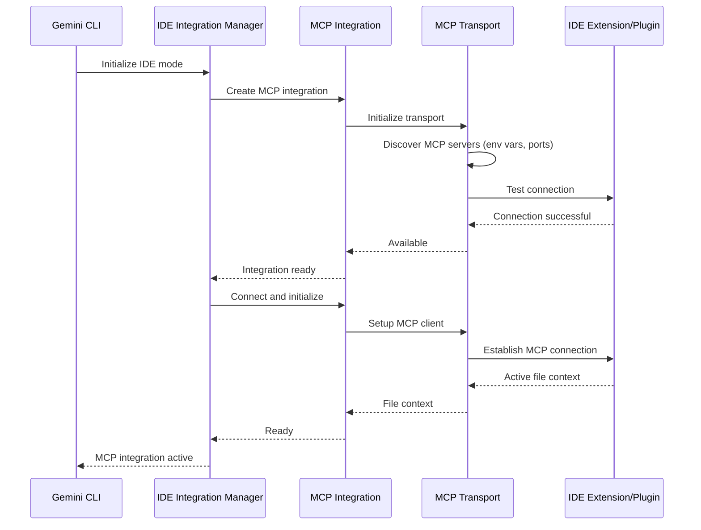
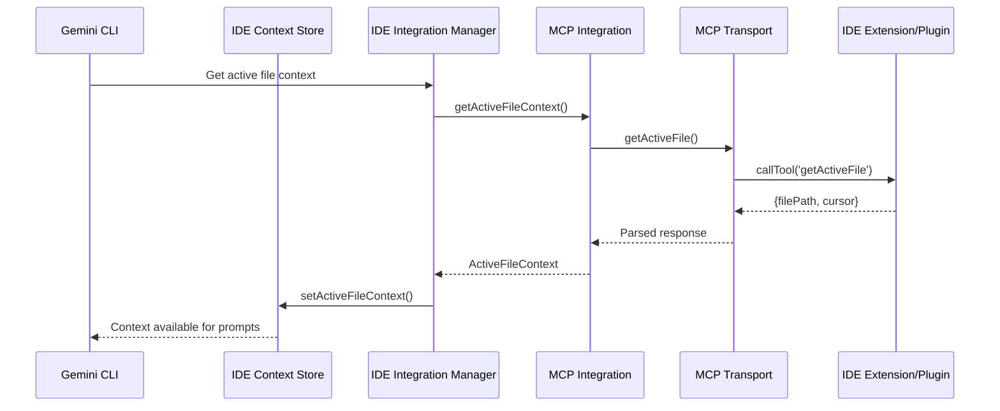
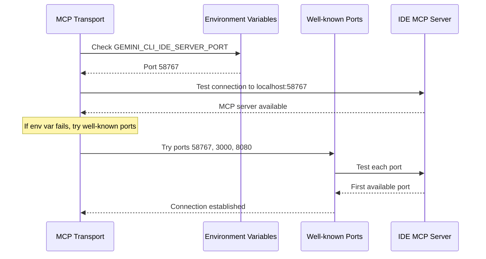

# IDE Integration Architecture

This document provides a detailed overview of the protocol-first IDE integration system architecture in Gemini CLI.

## System Overview

The IDE integration system enables Gemini CLI to communicate with various IDEs and editors to provide context-aware assistance. The architecture follows a protocol-first design pattern, similar to the Language Server Protocol (LSP) and Debug Adapter Protocol (DAP).

Key principles:

- **Protocol-First**: Uses Model Context Protocol (MCP) as the abstraction layer
- **IDE-Agnostic**: Gemini CLI has no IDE-specific knowledge
- **Extensible**: New IDEs can integrate without core changes
- **Auto-Discovery**: Automatically detects MCP-compatible IDEs
- **Non-blocking**: Failures don't prevent CLI operation

## Architecture Overview

### Protocol-First Design

Unlike traditional IDE-specific integrations, this system uses a protocol-first approach where the protocol (MCP) is the abstraction layer:

```
┌─────────────────┐    MCP Protocol    ┌──────────────────────┐
│   Gemini CLI    │◄─────────────────► │ IDE Companion       │
│  (IDE-agnostic) │     HTTP/WebSocket │ Extension/Plugin     │
└─────────────────┘                    └──────────────────────┘
                                                │
                                                ▼
                                       ┌──────────────────────┐
                                       │ IDE (VS Code,        │
                                       │ IntelliJ, Vim, etc.) │
                                       └──────────────────────┘
```

### Architecture Layers

```
┌─────────────────────────────────────────────────┐
│                Gemini CLI App                   │
│  ┌─────────────────────────────────────────┐    │
│  │           IDE Context Store             │    │
│  │  - Active file information              │    │
│  │  - Cursor position                      │    │
│  │  - File change notifications            │    │
│  └─────────────────────────────────────────┘    │
└─────────────────────────────────────────────────┘
                         │
                         ▼
┌─────────────────────────────────────────────────┐
│         IDE Integration Manager                 │
│  ┌─────────────────────────────────────────┐    │
│  │        Single MCP Integration           │    │
│  │  - Generic MCP protocol handling        │    │
│  │  - Auto-discovery of MCP servers        │    │
│  │  - Event handling and bridging          │    │
│  └─────────────────────────────────────────┘    │
└─────────────────────────────────────────────────┘
                         │
                         ▼
┌─────────────────────────────────────────────────┐
│              MCP Transport Layer                │
│  ┌─────────────────────────────────────────┐    │
│  │           Generic MCP Client            │    │
│  │  - Server discovery (env vars, ports)   │    │
│  │  - HTTP/WebSocket communication         │    │
│  │  - Tool calls and notifications         │    │
│  └─────────────────────────────────────────┘    │
└─────────────────────────────────────────────────┘
                         │
                         ▼
┌─────────────────────────────────────────────────┐
│            IDE MCP Servers                      │
│  ┌─────────────┐  ┌─────────────┐  ┌──────────┐ │
│  │   VS Code   │  │  IntelliJ   │  │   Vim    │ │
│  │ Extension   │  │   Plugin    │  │  Plugin  │ │
│  │             │  │             │  │          │ │
│  │ - MCP Server│  │ - MCP Server│  │- MCP Srvr│ │
│  │ - File APIs │  │ - File APIs │  │- File API│ │
│  └─────────────┘  └─────────────┘  └──────────┘ │
└─────────────────────────────────────────────────┘
```

## Data Flow

### 1. Initialization Flow



### 2. Active File Detection Flow



### 3. Auto-Discovery Flow



## Key Components

### MCPIDEIntegration

**Purpose**: Generic MCP-based IDE integration that works with any MCP-compatible IDE.

**Responsibilities**:

- Provide uniform interface regardless of IDE type
- Handle MCP protocol communication
- Manage connection lifecycle

**Interface**:

```typescript
class MCPIDEIntegration implements IDEIntegration {
  async isAvailable(): Promise<boolean>;
  async getActiveFileContext(): Promise<ActiveFileContext | null>;
  async sendNotification(message: string): Promise<void>;
  setActiveFileChangeHandler(
    handler: (context: ActiveFileContext | null) => void,
  ): void;
  async initialize(): Promise<void>;
  async cleanup(): Promise<void>;
}
```

### MCPTransport

**Purpose**: Generic MCP transport that discovers and communicates with MCP servers.

**Responsibilities**:

- Auto-discover MCP servers through multiple methods
- Handle HTTP/WebSocket MCP communication
- Manage MCP client lifecycle
- Parse and format MCP messages

**Discovery Methods**:

1. Environment variables (`GEMINI_CLI_IDE_SERVER_PORT`)
2. Well-known ports (58767, 3000, 8080)
3. Process detection (future enhancement)
4. Configuration files (future enhancement)

**Interface**:

```typescript
class MCPTransport {
  async isAvailable(): Promise<boolean>;
  async initialize(): Promise<void>;
  async getActiveFile(): Promise<ActiveFileContext | null>;
  setNotificationHandler(
    handler: (context: ActiveFileContext | null) => void,
  ): void;
  async sendNotification(message: string): Promise<void>;
  async cleanup(): Promise<void>;
}
```

### IDEIntegrationManager

**Purpose**: Simplified manager for the single MCP integration.

**Changes from Registry System**:

- No longer manages multiple IDE types
- Single MCP integration instead of registry
- Simplified initialization and status reporting

**Responsibilities**:

- Initialize MCP integration
- Bridge MCP events to IDE context
- Provide status information
- Handle graceful failure

**Key Methods**:

```typescript
class IDEIntegrationManager {
  async initialize(config: IDEIntegrationConfig): Promise<void>;
  async getStatus(): Promise<{
    active: boolean;
    integration?: { type: string; available: boolean };
  }>;
  async connectToMCP(config: IDEIntegrationConfig): Promise<boolean>;
  getActiveIntegration(): IDEIntegration | null;
  isActive(): boolean;
  async cleanup(): Promise<void>;
}
```

### IDEIntegration Interface (Protocol-First)

**Purpose**: Simplified contract for MCP-based integrations.

**Changes from Registry System**:

- Removed `id`, `name`, `description` properties (no longer needed)
- Added `setActiveFileChangeHandler` method
- Focus on protocol methods, not IDE identity

**Interface**:

```typescript
interface IDEIntegration {
  // Core protocol methods
  isAvailable(): Promise<boolean>;
  getActiveFileContext(): Promise<ActiveFileContext | null>;
  sendNotification(message: string): Promise<void>;

  // Event handling
  setActiveFileChangeHandler(
    handler: (context: ActiveFileContext | null) => void,
  ): void;

  // Lifecycle
  initialize(): Promise<void>;
  cleanup(): Promise<void>;
}
```

## Configuration System

### MCP Server Discovery

The system discovers MCP servers through multiple methods in order:

```typescript
// Method 1: Environment variable (primary)
const port = process.env.GEMINI_CLI_IDE_SERVER_PORT;

// Method 2: Well-known ports (fallback)
const wellKnownPorts = [58767, 3000, 8080];

// Method 3: Future enhancements
// - Process scanning
// - Configuration files
// - Registry entries
```

### Integration Configuration

```typescript
interface IDEIntegrationConfig {
  environment: Record<string, string | undefined>;
  timeout?: number; // Default: 5000ms for availability, 10000ms for initialization
  debug?: boolean;
}
```

### IDE Mode Detection

```typescript
const ideMode =
  (argv.ideMode ?? settings.ideMode ?? false) && !process.env.SANDBOX;
```

Note: No longer requires `TERM_PROGRAM === 'vscode'` - works with any MCP-compatible IDE.

## Benefits of Protocol-First Architecture

### For Gemini CLI Core

1. **Simplified Codebase**: Single integration instead of multiple IDE-specific classes
2. **No IDE-Specific Knowledge**: Core doesn't need to know about VS Code, IntelliJ, etc.
3. **Easier Maintenance**: One code path instead of many
4. **Better Testability**: Single integration to test thoroughly

### For IDE Developers

1. **Standard Protocol**: Implement MCP instead of custom Gemini CLI APIs
2. **Industry Standard**: MCP follows LSP/DAP patterns that developers know
3. **Future-Proof**: Protocol evolution handled at MCP level
4. **Tool Reuse**: MCP servers can work with multiple clients

### For Users

1. **Consistent Experience**: Same integration quality across all IDEs
2. **Automatic Discovery**: Works when IDE MCP server is available
3. **Better Reliability**: Simpler system with fewer failure points
4. **Broader IDE Support**: Any IDE can add MCP support

## Error Handling Strategy

### Non-blocking Initialization

- MCP integration failures don't prevent CLI startup
- Graceful degradation when no MCP server is found
- Clear status messages via `/ide status`

### Auto-Discovery Resilience

- Multiple discovery methods provide fallbacks
- Network timeout handling for connection tests
- Clean error messages for users

### Connection Recovery

- Automatic server detection on each operation
- Fallback to manual file specification
- Resource cleanup on connection failures

## Security Considerations

### Trust Model

- MCP servers run locally (localhost only)
- No external network communication
- Implicit trust for local IDE extensions

### Protocol Security

- MCP protocol handles authentication/authorization
- Standard HTTP/WebSocket security practices
- No sensitive data in discovery process

### Isolation

- MCP integration isolated from other CLI functions
- Failed connections don't affect CLI operation
- Proper resource cleanup prevents leaks

## Future Extensions

### Protocol Evolution

- Support for WebSocket MCP connections
- Enhanced notification systems
- Bidirectional tool calling

### Discovery Enhancements

- Process-based detection
- Configuration file discovery
- IDE-specific registry checks
- Network service discovery

### Advanced Features

- Multi-workspace support
- Language-specific context
- Debugging session integration
- Project-aware suggestions

## Comparison: Registry vs Protocol-First

### Before (Registry-Based)

```
Gemini CLI
├── IDEIntegrationRegistry
│   ├── VSCodeIntegrationFactory
│   ├── IntelliJIntegrationFactory
│   └── VimIntegrationFactory
├── VSCodeIntegration (IDE-specific)
├── IntelliJIntegration (IDE-specific)
└── VimIntegration (IDE-specific)
```

**Issues**:

- Each IDE requires custom integration code
- Registry manages multiple integration types
- Complex initialization and status tracking
- IDE-specific knowledge in core

### After (Protocol-First)

```
Gemini CLI
├── IDEIntegrationManager (simplified)
├── MCPIDEIntegration (generic)
└── MCPTransport (protocol handler)
```

**Benefits**:

- Single generic integration for all IDEs
- No IDE-specific code in core
- Simpler architecture and testing
- Standard MCP protocol interface

## Implementation Notes

### MCP Tool Expectations

IDE MCP servers should implement:

```typescript
// Required MCP tool
{
  name: "getActiveFile",
  description: "Get the currently active file and cursor position",
  inputSchema: {
    type: "object",
    properties: {}
  }
}

// Expected response format
"Active file: /path/to/file.ts (line: 10, char: 5)"
// or
"Active file: /path/to/file.ts"
// or
"No file is currently active"
```

### Notification Handling

```typescript
// Expected MCP notification (future enhancement)
{
  method: "activeFileNotification",
  params: {
    filePath?: string,
    cursor?: {
      line: number,
      character: number
    }
  }
}
```

### Environment Setup

IDE extensions should set:

```bash
# Primary discovery method
export GEMINI_CLI_IDE_SERVER_PORT=58767

# Extension should run MCP server on specified port
# and implement required tools and notifications
```

This protocol-first architecture provides a clean, maintainable, and extensible foundation for IDE integration that follows industry standards and best practices.
