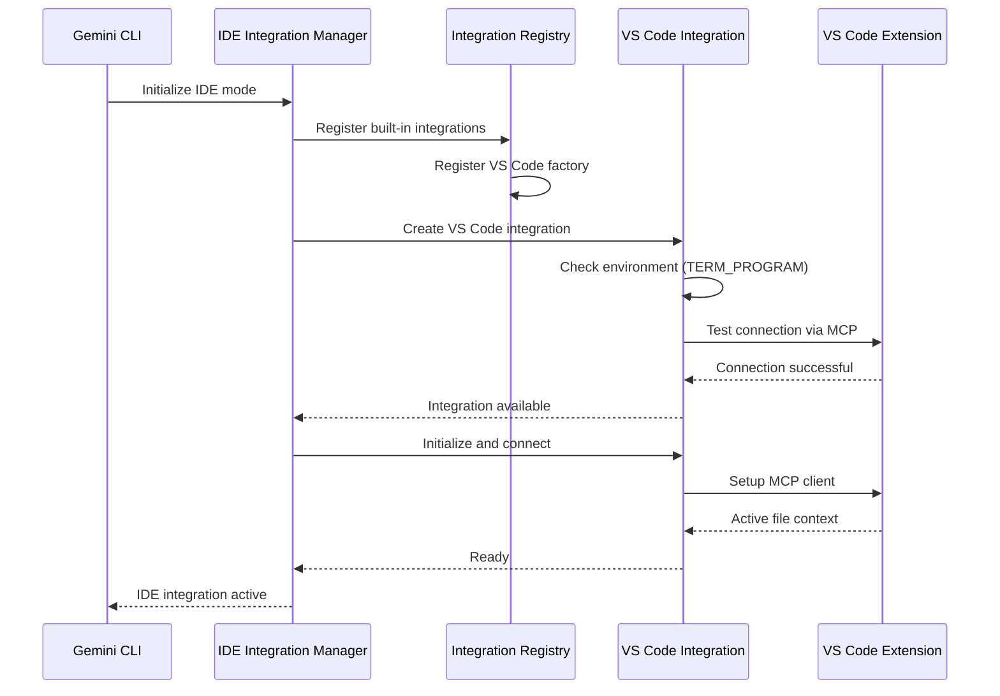
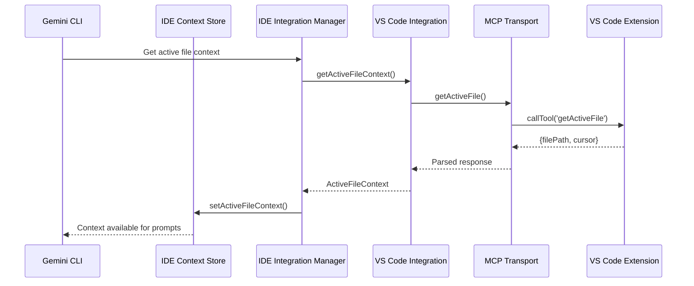
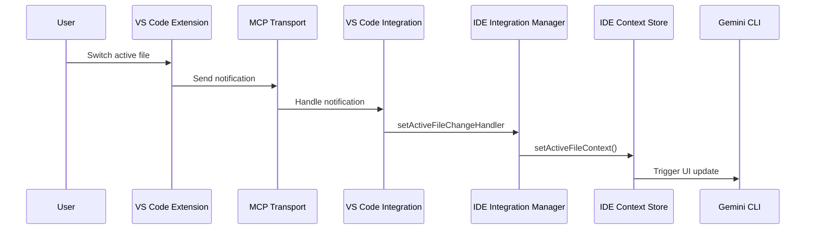

# IDE Integration Architecture

This document provides a detailed overview of the IDE integration system architecture in Gemini CLI.

## System Overview

The IDE integration system enables Gemini CLI to communicate with various IDEs and editors to provide context-aware assistance. The architecture is designed to be:

- **Extensible**: Easy to add new IDE integrations
- **Modular**: Clean separation of concerns
- **Non-blocking**: Failures don't prevent CLI operation
- **Backward compatible**: Existing functionality preserved

## Architecture Layers

### 1. Application Layer

The main Gemini CLI application that uses IDE context for enhanced prompts and suggestions.

```
┌─────────────────────────────────────────────────┐
│                Gemini CLI App                   │
│  ┌─────────────────────────────────────────┐    │
│  │           IDE Context Store             │    │
│  │  - Active file information              │    │
│  │  - Cursor position                      │    │
│  │  - File change notifications            │    │
│  └─────────────────────────────────────────┘    │
└─────────────────────────────────────────────────┘
```

### 2. Integration Management Layer

Coordinates all IDE integrations and provides a unified interface.

```
┌─────────────────────────────────────────────────┐
│            IDE Integration Manager              │
│  ┌─────────────────────────────────────────┐    │
│  │         Registry System                 │    │
│  │  - Plugin discovery                     │    │
│  │  - Factory management                   │    │
│  │  - Lifecycle coordination               │    │
│  └─────────────────────────────────────────┘    │
│  ┌─────────────────────────────────────────┐    │
│  │        Active Integration               │    │
│  │  - Single active IDE connection         │    │
│  │  - Event handling and bridging          │    │
│  │  - Error recovery                       │    │
│  └─────────────────────────────────────────┘    │
└─────────────────────────────────────────────────┘
```

### 3. Plugin Implementation Layer

IDE-specific integration implementations.

```
┌─────────────────────────────────────────────────┐
│              IDE Integrations                   │
│  ┌─────────────┐  ┌─────────────┐  ┌──────────┐ │
│  │   VS Code   │  │  JetBrains  │  │   Zed    │ │
│  │ Integration │  │ Integration │  │Integration│ │
│  │             │  │             │  │          │ │
│  │ - Detection │  │ - Detection │  │- Detection│ │
│  │ - File Ctx  │  │ - File Ctx  │  │- File Ctx│ │
│  │ - Notify    │  │ - Notify    │  │- Notify  │ │
│  └─────────────┘  └─────────────┘  └──────────┘ │
└─────────────────────────────────────────────────┘
```

### 4. Transport Layer

Communication protocols between CLI and IDE.

```
┌─────────────────────────────────────────────────┐
│               Transport Layer                   │
│  ┌─────────────┐  ┌─────────────┐  ┌──────────┐ │
│  │     MCP     │  │     LSP     │  │  Custom  │ │
│  │  over HTTP  │  │   Protocol  │  │ Protocol │ │
│  │             │  │             │  │          │ │
│  │ - Tool calls│  │ - Requests  │  │- Messages│ │
│  │ - Notifications│ │ - Events  │  │- Events  │ │
│  └─────────────┘  └─────────────┘  └──────────┘ │
└─────────────────────────────────────────────────┘
```

### 5. IDE/Editor Layer

The actual IDE or editor with companion extensions/plugins.

```
┌─────────────────────────────────────────────────┐
│                IDE/Editor                       │
│  ┌─────────────┐  ┌─────────────┐  ┌──────────┐ │
│  │   VS Code   │  │  IntelliJ   │  │   Zed    │ │
│  │ Extension   │  │   Plugin    │  │Extension │ │
│  │             │  │             │  │          │ │
│  │ - MCP Server│  │ - API Server│  │- Handler │ │
│  │ - File Watch│  │ - File Watch│  │- Events  │ │
│  └─────────────┘  └─────────────┘  └──────────┘ │
└─────────────────────────────────────────────────┘
```

## Data Flow

### 1. Initialization Flow



### 2. Active File Detection Flow



### 3. File Change Notification Flow



## Key Components

### IDEIntegrationRegistry

**Purpose**: Central registry for all IDE integration factories.

**Responsibilities**:

- Register integration factories by ID
- Create integration instances
- Manage integration lifecycle
- Prevent duplicate registrations

**Interface**:

```typescript
class IDEIntegrationRegistry {
  register(id: string, factory: IDEIntegrationFactory): void;
  create(id: string, config: IDEIntegrationConfig): Promise<IDEIntegration>;
  isRegistered(id: string): boolean;
  getRegisteredIds(): string[];
  unregister(id: string): void;
  cleanup(): Promise<void>;
}
```

### IDEIntegrationManager

**Purpose**: Singleton manager that coordinates IDE integrations.

**Responsibilities**:

- Initialize and detect available IDE integrations
- Maintain single active integration
- Bridge integration events to legacy `ideContext`
- Handle graceful failure and recovery

**State Management**:

- `initialized`: Whether manager has been initialized
- `activeIntegration`: Currently active IDE integration (if any)

**Key Methods**:

- `initialize()`: Setup and detect available IDEs
- `detectAndConnect()`: Try integrations in priority order
- `getStatus()`: Get current integration status
- `cleanup()`: Clean up all resources

### IDEIntegration Interface

**Purpose**: Contract that all IDE integrations must implement.

**Core Methods**:

```typescript
interface IDEIntegration {
  readonly id: string;
  readonly name: string;
  readonly description: string;

  isAvailable(): Promise<boolean>;
  getActiveFileContext(): Promise<ActiveFileContext | null>;
  sendNotification(message: string): Promise<void>;
  initialize(): Promise<void>;
  cleanup(): Promise<void>;
}
```

**Implementation Pattern**:

1. Constructor accepts `IDEIntegrationConfig`
2. `isAvailable()` performs environment detection
3. `initialize()` sets up communication channel
4. `getActiveFileContext()` returns current file info
5. `cleanup()` releases resources

## Configuration System

### IDE Mode Detection

```typescript
const ideMode =
  (argv.ideMode ?? settings.ideMode ?? false) &&
  process.env.TERM_PROGRAM === 'vscode' &&
  !process.env.SANDBOX;
```

### Integration Configuration

```typescript
interface IDEIntegrationConfig {
  environment: Record<string, string | undefined>;
  timeout: number;
  debug: boolean;
}
```

### Discovery Priority

Integrations are attempted in order:

1. VS Code (if `TERM_PROGRAM === 'vscode'`)
2. JetBrains (if JetBrains environment detected)
3. Zed (if Zed environment detected)
4. Generic detection fallbacks

## Error Handling Strategy

### Non-blocking Initialization

- IDE integration failures don't prevent CLI startup
- Graceful degradation when no IDE is available
- Debug logging for troubleshooting

### Connection Recovery

- Automatic reconnection attempts
- Fallback to manual file specification
- Clear error messages for users

### Resource Management

- Proper cleanup on shutdown
- Connection timeout handling
- Memory leak prevention

## Integration with Existing Systems

### Legacy IDE Context Bridge

The new system maintains compatibility with existing `ideContext`:

```typescript
// Bridge pattern in IDE Integration Manager
integration.setActiveFileChangeHandler((context) => {
  if (context) {
    ideContext.setActiveFileContext({
      filePath: context.filePath,
      cursor: context.cursor,
    });
  } else {
    ideContext.clearActiveFileContext();
  }
});
```

### Tool Registry Integration

IDE integrations don't register tools in the main tool registry. Instead:

- Direct communication through integration interface
- No MCP tool discovery for IDE servers
- Isolated from general MCP tool system

### Configuration System Integration

- Uses existing CLI configuration flags (`--ide-mode`)
- Respects debug mode settings
- Integrates with settings files

## Performance Considerations

### Lazy Initialization

- Integrations only initialize when IDE mode is enabled
- Connection setup happens asynchronously
- No impact on CLI startup time

### Resource Efficiency

- Single active integration (not multiple simultaneous)
- Connection pooling where appropriate
- Minimal memory footprint

### Scalability

- Registry pattern supports unlimited integrations
- Factory pattern enables efficient instantiation
- Clean separation allows independent development

## Security Considerations

### Trust Model

- IDE integrations are implicitly trusted (no confirmation prompts)
- Local communication only (no external network calls)
- Environment-based detection (no file system scanning)

### Isolation

- Each integration is isolated from others
- Failed integrations don't affect system stability
- Proper error boundaries and exception handling

## Future Extensions

### Multi-IDE Support

While currently single-active, the architecture supports future multi-IDE scenarios:

- Registry can manage multiple active integrations
- Event routing to multiple destinations
- Conflict resolution for overlapping contexts

### Protocol Extensibility

The transport layer can support new protocols:

- WebSocket connections
- Direct TCP/UDP
- Message queues
- Shared memory

### Advanced Features

Future enhancements could include:

- IDE-specific tool suggestions
- Project-aware context
- Language server integration
- Debugging session context
